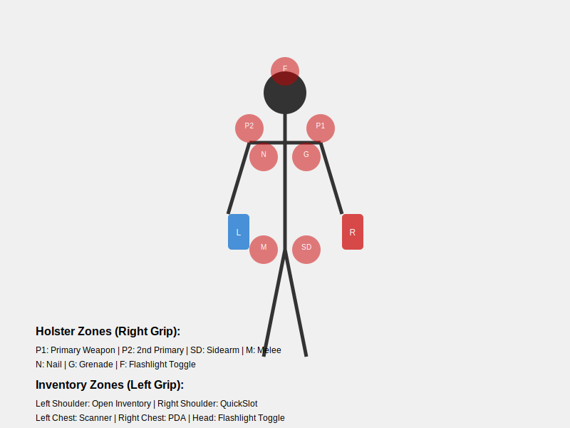

# STALKER 2 UEVR Plugin

A plugin for UEVR (Unreal Engine VR) that enhances the VR experience in S.T.A.L.K.E.R. 2.

## Current Features

- **Fixed Weapon Origin Alignment**: Ensures bullets shoot correctly from the muzzle position
- **Advanced Gesture-Based Holster System**: Comprehensive body zone mapping for weapon and tool interactions
- **Dual-Hand Support**: Full configuration support for both left-handed and right-handed users
- **Weapon Interaction Zones**: Reload, fire mode switching, and two-handed aiming gestures
- **Controller Remapping**: Intelligent gamepad button remapping based on dominant hand settings
- **Haptic Feedback**: Zone-based haptic feedback for gesture recognition
- **Full Recoil Effects**: Enhanced VR weapon handling with realistic recoil
- **Configurable Gesture System**: Individual gestures can be enabled/disabled via configuration
## HOW TO - Holster System, Weapon Interaction Zones:

This mod features an advanced gesture-based holster system that maps body zones to weapon and tool interactions. The system adapts based on your dominant hand setting (configurable in the VR Mod Config UI).

### Body Zone Gestures

**Holster Zones**: Move your hand into a zone to feel haptic feedback, then press the Grip button to activate the gesture. The system supports both left-handed and right-handed configurations.

#### For Right-Handed Users (Default):

| VR Hand | Grip Button | Body Zone | Action | Keyboard Key |
|---------|-------------|-----------|--------|--------------|
| **Left Hand** | Left Grip | Head | Toggle Flashlight | L |
| **Left Hand** | Left Grip | Left Shoulder | Primary Weapon | 3 |
| **Left Hand** | Left Grip | Right Shoulder | Inventory | I |
| **Left Hand** | Left Grip | Left Hip | Sidearm | 2 |
| **Left Hand** | Left Grip | Right Chest | Scanner | 7 |
| **Left Hand** | Left Grip | Left Chest | Grenade | 5 |
| **Right Hand** | Right Grip | Head | Toggle Flashlight | L |
| **Right Hand** | Right Grip | Right Shoulder | Primary Weapon | 3 |
| **Right Hand** | Right Grip | Left Shoulder | Secondary Weapon | 4 |
| **Right Hand** | Right Grip | Right Hip | Sidearm | 2 |
| **Right Hand** | Right Grip | Right Chest | Bolt Action | 6 |
| **Right Hand** | Right Grip | Left Chest | PDA | M |
| **Left Hand** | Right Grip | Left Hip | Melee Weapon | 1 |

#### For Left-Handed Users:

| VR Hand | Grip Button | Body Zone | Action | Keyboard Key |
|---------|-------------|-----------|--------|--------------|
| **Left Hand** | Left Grip | Head | Toggle Flashlight | L |
| **Left Hand** | Left Grip | Left Shoulder | Primary Weapon | 3 |
| **Left Hand** | Left Grip | Right Shoulder | Secondary Weapon | 4 |
| **Left Hand** | Left Grip | Left Hip | Sidearm | 2 |
| **Left Hand** | Left Grip | Left Chest | Bolt Action | 6 |
| **Left Hand** | Left Grip | Right Chest | PDA | M |
| **Right Hand** | Right Grip | Head | Toggle Flashlight | L |
| **Right Hand** | Right Grip | Right Hip | Melee Weapon | 1 |
| **Right Hand** | Right Grip | Right Chest | Grenade | 5 |
| **Right Hand** | Right Grip | Left Shoulder | Inventory | I |
| **Right Hand** | Right Grip | Left Chest | Scanner | 7 |

### Weapon Interaction Zones

**Weapon Zones**: These zones are positioned around your weapon hand and activated by your non-dominant hand.

| Trigger Hand | Zone Position | Action | Keyboard Key |
|--------------|---------------|--------|--------------|
| Left Trigger | Near weapon (mode switch zone) | Fire Mode Switch | B |
| Left Trigger | Below weapon (reload zone) | Reload | R |
| Left Trigger | Forward of weapon (barrel zone) | Two-Handed Aiming | - |

### VR Controller Button Mapping

The plugin modifies the standard gamepad button mapping based on your dominant hand setting:

#### Right-Handed Mode:
- **Left Grip**: Converted to left trigger input when active
- **Right Trigger**: Converted to left shoulder button when pressed (>125 threshold)
- **Left Trigger**: Mapped to right trigger

#### Left-Handed Mode:
- **Right Grip**: Converted to right trigger input when active  
- **Left Trigger**: Converted to left shoulder button when pressed (>125 threshold)
- **Right Trigger**: Mapped to left trigger

**Note**: Grip buttons are temporarily disabled when gesture zones are locked (during gesture activation).

## Configuration

The plugin includes an in-game configuration UI accessible via the VR Mod Config panel:

### General Settings
- **Dominant Hand**: Left or Right (affects entire gesture mapping)
- **Sitting Experience**: Toggle between sitting and standing gesture zones
- **Recoil**: Enable/disable recoil effects
- **Haptic Feedback**: Enable/disable haptic feedback for gestures
- **Two-Handed Aiming**: Enable/disable two-handed weapon aiming
- **Virtual Gunstock**: Toggle virtual gunstock simulation

### Scope Settings
- **Scope Brightness Amplifier**: Adjust scope brightness (default: 1.0)
- **Scope Diameter**: Control scope view diameter (default: 0.03)
- **Scope Magnifier**: Adjust scope magnification (default: 0.6)
- **Scope Texture Size**: Set scope rendering resolution (default: 1024)

### Individual Gesture Controls
Each gesture can be individually enabled or disabled:
- Flashlight, Primary Weapon, Secondary Weapon, Sidearm Weapon
- Melee Weapon, Bolt Action, Grenade, Inventory
- Scanner, PDA, Reload, Mode Switch

Configuration is automatically saved to `settings.json` and loaded on startup.
## Work in Progress

The plugin continues to evolve with ongoing development. Current priorities include:

### Enhanced Scope Implementation
- Improved foveated screen capture for scoped weapons
- Better scope rendering optimization
- Dynamic scope adjustment based on weapon type

### Animation Integration
- Seamless integration with game animations
- Prevention of FOV conflicts during weapon animations
- Enhanced weapon state management

### Additional Gesture Features
- More weapon-specific gestures
- Enhanced interaction feedback
- Improved zone detection accuracy

### Performance Optimizations
- Reduced computational overhead for gesture detection
- Memory usage optimizations
- Better integration with UEVR core systems

## Installation

1. Install UEVR following the official instructions from [UEVR's website](https://uevr.io)
2. Install this plugin according to UEVR's plugin installation guidelines

## Known Issues

- Scope functionality is still being refined for optimal VR experience
- Some weapon animations may occasionally affect weapon positioning
- Zone detection sensitivity may require fine-tuning for different play styles
- Performance may vary depending on VR hardware configuration

## Contributing

This is a work in progress project. Contributions and suggestions are welcome.

## Disclaimer

This is an unofficial modification for S.T.A.L.K.E.R. 2. Not affiliated with GSC Game World.

## License

MIT License

Copyright (c) 2025 mutars

Permission is hereby granted, free of charge, to any person obtaining a copy
of this software and associated documentation files (the "Software"), to deal
in the Software without restriction, including without limitation the rights
to use, copy, modify, merge, publish, distribute, sublicense, and/or sell
copies of the Software, and to permit persons to whom the Software is
furnished to do so, subject to the following conditions:

The above copyright notice and this permission notice shall be included in all
copies or substantial portions of the Software.

THE SOFTWARE IS PROVIDED "AS IS", WITHOUT WARRANTY OF ANY KIND, EXPRESS OR
IMPLIED, INCLUDING BUT NOT LIMITED TO THE WARRANTIES OF MERCHANTABILITY,
FITNESS FOR A PARTICULAR PURPOSE AND NONINFRINGEMENT. IN NO EVENT SHALL THE
AUTHORS OR COPYRIGHT HOLDERS BE LIABLE FOR ANY CLAIM, DAMAGES OR OTHER
LIABILITY, WHETHER IN AN ACTION OF CONTRACT, TORT OR OTHERWISE, ARISING FROM,
OUT OF OR IN CONNECTION WITH THE SOFTWARE OR THE USE OR OTHER DEALINGS IN THE
SOFTWARE.

---
Last updated: 2025-02-19 04:33:57 UTC
